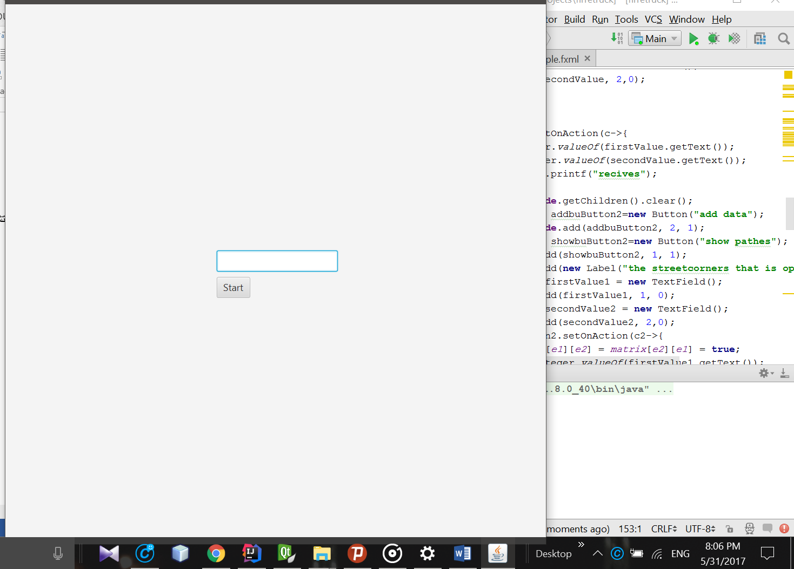

# **Street Path Finder**

## **Overview**

The **Street Path Finder** is a JavaFX-based application designed to visualize and analyze paths between street corners. Users can input street corner connections, visualize potential paths, and analyze connectivity using depth-first search (DFS) algorithms. The project provides an interactive graphical user interface for ease of use.

## Features 

- **Java** – Core programming language.
- **JavaFX** – For building the graphical user interface.
- **Algorithms** – DFS for pathfinding and connectivity analysis.

## Prerequisites

Ensure you have the following installed on your system:

- Java Development Kit (JDK 8 or higher)
- JavaFX libraries (included in JDK 11+)
- An IDE that supports JavaFX (e.g., IntelliJ IDEA, Eclipse)

## **Usage**

1. **Starting the Application:**
   - Run the application, and a window will appear with a text input and "Start" button.



1. **Input Street Connections:**
   - Enter the number of street corners in the text field and click "Start."
   - Input connections between street corners by specifying values in the text fields and clicking "Add Data."
2. **Viewing Paths:**
   - Click the "Show Paths" button to visualize available paths between street corners.

## **Project Structure**

```bash
src/
│-- sample/
│   ├── Main.java          # Main entry point for the JavaFX application
│   ├── Controller.java    # Placeholder controller for UI interaction
│   ├── sample.fxml        # JavaFX UI layout definition
```

## **License**

This project is licensed under the MIT License. See the [LICENSE](LICENSE) file for details.
