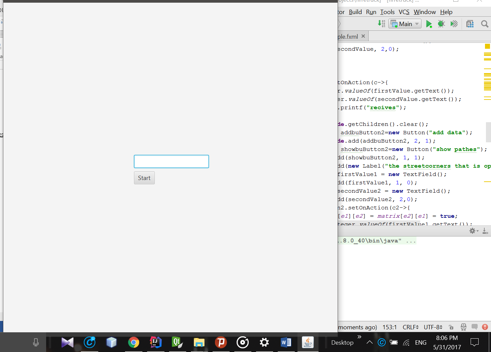
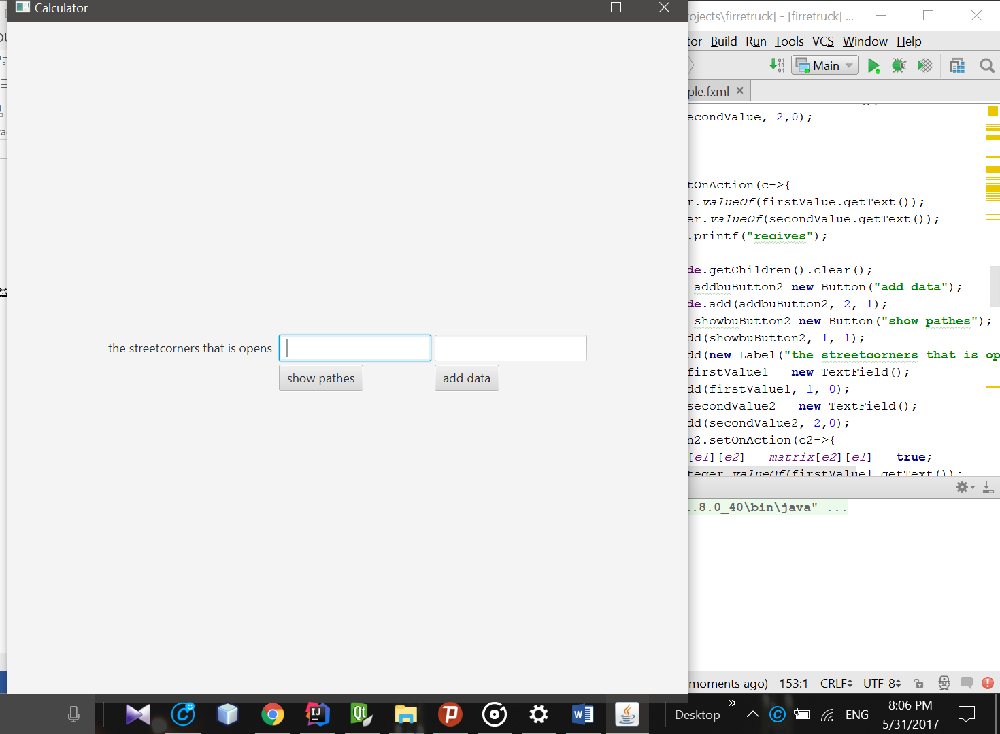

## توضیحات پروژه مرکز آتش نشانی 

در این پروژه ورودی های ما شامل شماره نزدیک ترین تقاطع به مرکز آتش است که باید آتش نشانان خود را به آن برسانند 

که در صفحه اول ورودی پس از اجرا شدن برنامه از کاربر درخواست میشود .

پس از وارد کردن شماره تقاطع که شامل یکی از اعداد 1 تا 21 میباشد (چون 21 منطقه آتش نشانی داریم ) 

حالا باید ورودی های بعدی را بدهیم 

این ورودی ها عدد های صحیح دو تایی هستند که تا هنگامی که شما از کاربر درخواست نتیجه را نکنید تکرار میشود 

ورودی ها شامل دو تا عدد صحیح هستند که برای مثال اگر اعداد 2 و 4 قرار داده شوند بدین معناست که بین این دو تقاطع مانعی وجود ندارد ینی مسیری مستقیم بدون وجود هیچ تقاطع دیگری بین این دو مسیر وجود دارد 

اجرای الگوریتم ! : 

در این برنامه ما از روش عقبگرد و یا همان back tracking  برای پیاده سازی برنامه استفاده کردیم 

روش کار بدین صورت است که شماره های تقاطع های باز در آرایه matrix  که آرایه ای از نو Boolean  است 

با هر بار ورودی دو عدد دو خانه آن به معنای آن که بین این دو خالی است و مانعی وجود ندارد ذخیر میشود

در تابع dfs درخت پوشای بهینه ما به وسیله آرایه vanvisit  به دست میآید که یک تابع بازگشتی است 

 

تابع دیگری که در این برنامه کاربرده شده است تابع generatpath  است که بدین صورت مسیرهای موجود از راس 1 که همیشه راس مرکز آتش نشانی است را به شماره راس مرکز آتش نشان میدهد 

روش کار بدین صورت است که در درخت پوشای بهینه که تابع dfs  خروجی آرایه canvisit  را داشته است و در این آرایه شروع به حرکت در درخت میکنیم و مسیر های مورد نظر و توانا را به دست می آوریم 

سپس با استفاده از ui مورد نظر خروجی برنامه را چاپ میکنیم.

 